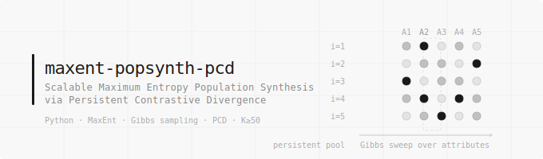

# maxent-popsynth-pcd

**Scalable Maximum Entropy Population Synthesis via Persistent Contrastive Divergence**

[](https://arxiv.org/abs/2503.XXXXX)
[](https://www.python.org/)
[](LICENSE)
> ⚠️ **Work in progress** — code and paper under active development.

---

## Overview

This repository accompanies the paper:

> Degli Esposti, M. (2026). *Scalable Maximum Entropy Population Synthesis via Persistent Contrastive Divergence*. arXiv:2503.XXXXX

**GibbsPCDSolver** replaces the intractable exact expectation step in Maximum Entropy population synthesis with a Persistent Contrastive Divergence estimate from a persistent Gibbs pool — removing the `|X|` barrier that limits exact MaxEnt to K ≈ 20 categorical attributes.

Key results:
- MRE ∈ [0.010, 0.018] across K ∈ {12, 20, 30, 40, 50} while `|X|` grows 18 orders of magnitude
- **86.8×** diversity advantage over generalised raking at K=15 (N_eff = N vs N_eff ≈ 0.012N)
- Runtime scales as O(K), not O(|X|)

---

## Repository structure

```
maxent-popsynth-pcd/
│
├── src/
    ├── evaluator.py
│   ├── constraint_set.py      # ConstraintSet — core data structure
│   ├── gibbs_pcd_solver.py    # GibbsPCDSolver — main algorithm
│   ├── solvers.py             # ExactMaxEntSolver, RakingSolver
│   ├── generators.py          # WuGenerator, PlantedExpFamilyGenerator
│   └── syn_istat/             # Syn-ISTAT benchmark
│       ├── attr_meta.py       # Attribute definitions and CPTs
│       └── exact_marginals.py # Analytical marginal computation
│
├── experiments/
    ├── helpers_a2.py
    ├── helpers_synistat.py 
│   ├── run_A0_toy.py          # Exp A0: Gibbs conditionals (K=6)
│   ├── run_A1a_wu_k8.py       # Exp A1a: Wu benchmark (K=8)
│   ├── run_A1b_planted_k10.py # Exp A1b: Planted exp-family (K=10)
│   ├── run_A1c_sensitivity.py # Exp A1c: Pool size & sweeps grid
│   ├── run_A2_scaling.py      # Exp A2: Scaling K=12..50
│   ├── run_AISTAT_heldout.py  # Exp A-ISTAT-2: Held-out ternary
│   ├── run_AISTAT_diversity.py# Exp A-ISTAT-3: Population diversity
│   └── run_AISTAT_sensitivity.py # Exp A-ISTAT-3: Pool size sensitivity
│
├── requirements.txt
└── README.md
```

---

## Installation

```bash
git clone https://github.com/mirko-degliesposti/maxent-popsynth-pcd
cd maxent-popsynth-pcd
pip install -r requirements.txt
```

Optional Numba acceleration (recommended for K ≥ 20):
```bash
pip install numba
```

---

## Quick start

```python
from src import ConstraintSet, GibbsPCDSolver, WuGenerator

# 1. Generate a synthetic benchmark (K=8, 4 planted binary patterns)
gen = WuGenerator(K=8, n_patterns=4, pattern_arity=2, seed=42)
data = gen.generate(n_samples=200_000)
cs = gen.extract_constraints(data)
print(cs.summary())

# 2. Fit GibbsPCDSolver
solver = GibbsPCDSolver(cs, use_numba=False)
solver.fit(N_pool=25_000, n_gibbs_sweeps=5, lr=0.01, verbose_every=50)
print(f"MRE = {solver.final_mre:.4f}  ({solver.n_iters} iterations)")

# 3. Access the learned population
# solver.lambdas  — Lagrange multipliers (m,)
# solver.history  — per-iteration diagnostics
```

---

## Syn-ISTAT benchmark

Syn-ISTAT is a K=15 Italian demographic benchmark with **analytically exact** marginal targets derived from ISTAT-inspired conditional probability tables (CPTs). It is the first benchmark for MaxEnt population synthesis in the non-enumerable regime (|X| ≈ 1.7 × 10⁸).

```python
from src.syn_istat import build_syn_istat_constraint_sets

cs_full, cs_train28, cs_held3 = build_syn_istat_constraint_sets()
print(cs_full.summary())
# ConstraintSet: K=15, m=280
#   Unary   (arity=1): 44
#   Binary  (arity=2): 233
#   Ternary (arity=3): 3
```

CPT tables and exact marginal computation code are in `src/syn_istat/`.

---

## Reproducing paper experiments

Each script in `experiments/` is self-contained and saves figures to `results/figures/`.

```bash
# Experiment A0 — Gibbs conditionals sanity check (K=6, ~2 min)
python experiments/run_A0_toy.py

# Experiment A2 — Scaling K=12..50 (requires Numba, ~2h)
python experiments/run_A2_scaling.py --use_numba

# Syn-ISTAT diversity experiment (~40 min at N=100K)
python experiments/run_AISTAT_diversity.py --N_pool 100000
```

---

## Citation

```bibtex
@article{degliesposti2026maxentpcd,
  author  = {Degli Esposti, Mirko},
  title   = {Scalable Maximum Entropy Population Synthesis
             via Persistent Contrastive Divergence},
  journal = {arXiv preprint arXiv:2503.XXXXX},
  year    = {2026}
}
```

---

## Acknowledgements

The author thanks François Pachet (ImagineAllThePeople) for stimulating discussions and for making available a preprint of Pachet & Zucker (2026) prior to publication, and Jean-Daniel Zucker (IRD-UMMISCO) for ongoing collaboration on the UrbIA project.

---

## License

MIT License — see [LICENSE](LICENSE).
