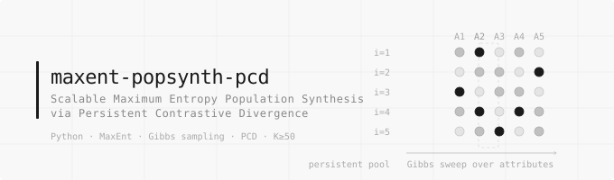

# maxent-popsynth-pcd

**Scalable Maximum Entropy Population Synthesis via Persistent Contrastive Divergence**

[](https://arxiv.org/abs/2603.27312)
[](https://www.python.org/)
[](LICENSE)

> **Status** — paper under review at ACM TKDD. The code that produced the
> published results is tagged [`submission-tkdd`](../../tree/submission-tkdd);
> `main` carries later performance work that does not change what the solver
> converges to. See [Reproducibility](#reproducibility).

---

## Overview

This repository accompanies the paper:

> Degli Esposti, M. (2026). *Scalable Maximum Entropy Population Synthesis via Persistent Contrastive Divergence*. arXiv:2603.27312

**GibbsPCDSolver** replaces the intractable exact expectation step in Maximum Entropy population synthesis with a Persistent Contrastive Divergence estimate from a persistent Gibbs pool — removing the `|X|` barrier that limits exact MaxEnt to K ≈ 20 categorical attributes.

Key results:
- MRE ∈ [0.010, 0.018] across K ∈ {12, 20, 30, 40, 50} while `|X|` grows 18 orders of magnitude
- **86.8×** diversity advantage over generalised raking at K=15 (N_eff = N vs N_eff ≈ 0.012N)
- Runtime scales as O(K), not O(|X|)

---

## Repository structure

```
maxent-popsynth-pcd/
│
├── src/
│   ├── constraint_set.py         # ConstraintSet — core data structure
│   ├── gibbs_pcd_solver.py       # GibbsPCDSolver — main algorithm
│   ├── gibbs_pcd_solver_old.py   # deprecated NumPy-lookup version, kept
│   │                             #   deliberately as a regression reference
│   ├── solvers.py                # ExactMaxEntSolver, RakingSolver
│   ├── generators.py             # WuGenerator, PlantedExpFamilyGenerator
│   ├── evaluator.py              # MRE, entropy, diversity metrics
│   ├── fast_F.py                 # mixed-radix slice construction of F
│   ├── test_F.py                 # regression tests for fast_F
│   └── syn_istat/                # Syn-ISTAT benchmark
│       ├── attr_meta.py          # attribute definitions and CPTs
│       └── exact_marginals.py    # analytical marginal computation
│
├── experiments/
│   ├── helpers_synistat.py       # shared runner for the Syn-ISTAT scripts
│   ├── helpers_a2.py             # shared runner for the scaling study
│   ├── run_A0_toy.py             # Exp A0: Gibbs conditionals (K=6)
│   ├── run_A1a_wu_k8.py          # Exp A1a: Wu benchmark (K=8)
│   ├── run_A1b_planted_k10.py    # Exp A1b: planted exp-family (K=10)
│   ├── run_A1c_sensitivity.py    # Exp A1c: pool size & sweeps grid
│   ├── run_A2_scaling.py         # Exp A2: scaling K=12..50, Numba speedup
│   ├── run_AISTAT_heldout.py     # Exp A-ISTAT-2: held-out ternary
│   ├── run_AISTAT_diversity.py   # Exp A-ISTAT-3: population diversity
│   └── run_AISTAT_sensitivity.py # Exp A-ISTAT-3: pool size sensitivity
│
├── requirements.txt
└── README.md
```

`gibbs_pcd_solver_old.py` is **not** leftover code. Keeping two
implementations that must produce identical output is a permanent
regression test: the CSR/Numba kernel is checked against the NumPy-lookup
reference, and any divergence between them is a bug in one of the two.

---

## Installation

```bash
git clone https://github.com/mirko-degli-esposti/maxent-popsynth-pcd
cd maxent-popsynth-pcd
pip install -r requirements.txt
```

Numba is **optional everywhere**: every experiment runs without it, only
slower. The CSR kernel avoids materialising the `(N, d_k)` float64 buffer
that dominates a Gibbs sweep (~1.4 GB at K=15), which is where its
advantage comes from — it computes the same quantities, not different ones.

```bash
pip install numba        # recommended for K ≥ 20 and for Exp A2
```

---

## Quick start

```python
from src import ConstraintSet, GibbsPCDSolver, WuGenerator

# 1. Generate a synthetic benchmark (K=8, 4 planted binary patterns)
gen = WuGenerator(K=8, n_patterns=4, pattern_arity=2, seed=42)
data = gen.generate(n_samples=200_000)
cs = gen.extract_constraints(data)
print(cs.summary())

# 2. Fit GibbsPCDSolver
solver = GibbsPCDSolver(cs, use_numba=False)
solver.fit(N_pool=25_000, n_gibbs_sweeps=5, lr=0.01, verbose_every=50)
print(f"MRE = {solver.final_mre:.4f}  ({solver.n_iters} iterations)")

# 3. Access the learned population
# solver.lambdas  — Lagrange multipliers (m,)
# solver.history  — per-iteration diagnostics
```

---

## Syn-ISTAT benchmark

Syn-ISTAT is a K=15 Italian demographic benchmark with **analytically exact** marginal targets derived from ISTAT-inspired conditional probability tables (CPTs). It is the first benchmark for MaxEnt population synthesis in the non-enumerable regime (|X| ≈ 1.7 × 10⁸).

```python
from src.syn_istat import build_syn_istat_constraint_sets

cs_full, cs_train28, cs_held3 = build_syn_istat_constraint_sets()
print(cs_full.summary())
# ConstraintSet: K=15, m=280
#   Unary   (arity=1): 44
#   Binary  (arity=2): 233
#   Ternary (arity=3): 3
```

CPT tables and exact marginal computation code are in `src/syn_istat/`.

---

## Reproducing paper experiments

Each script in `experiments/` is self-contained and writes figures to `figures/` (override with `--outdir`).

```bash
# Experiment A0 — Gibbs conditionals sanity check (K=6, ~2 min)
python experiments/run_A0_toy.py

# Experiment A2 — Scaling K=12..50 (~2h with Numba)
python experiments/run_A2_scaling.py
python experiments/run_A2_scaling.py --no_numba    # same results, slower

# Syn-ISTAT diversity experiment (~40 min at N=100K)
python experiments/run_AISTAT_diversity.py --N_pool 100000
```

---

## Reproducibility

The results reported in the paper were produced with the code at tag
`submission-tkdd` (31 March 2026):

```bash
git checkout submission-tkdd
```

**Accuracy and timing are measured separately, by design.**
`experiments/helpers_synistat.py` runs the accuracy experiments with
`use_numba=False`: the CSR kernel computes the same expectations as the
NumPy path, so disabling it keeps those runs independent of JIT
availability and of the machine. The speedup is measured on its own by
`experiments/run_A2_scaling.py`, which takes `use_numba` as a parameter and
compares both paths on the same constraint sets.

**What `main` adds after the submission**, none of it changing the fixed
point the solver converges to:

| commit | change |
|---|---|
| `1cb32af` | Gibbs warm start (`pool_init` / `lambdas_init`); mixed-radix slice construction of `F`, reused inside the solver |
| `c70175c` | block-wise expectation estimation via mixed-radix `bincount` — constraints sharing an attribute signature are estimated in one pass (~145× at K=15+) |
| `89ac15e` | harmonic step-size decay (`lr_tau`), `lambdas_ref` to track `‖λ − λ*‖` |

The tag `pre-warmstart` marks the state just before that work began.

---

## Citation

```bibtex
@article{degliesposti2026maxentpcd,
  author  = {Degli Esposti, Mirko},
  title   = {Scalable Maximum Entropy Population Synthesis
             via Persistent Contrastive Divergence},
  journal = {arXiv preprint arXiv:2603.27312},
  year    = {2026}
}
```

---

## Acknowledgements

The author thanks François Pachet (ImagineAllThePeople) for stimulating discussions and for making available a preprint of Pachet & Zucker (2026) prior to publication.

---

## License

MIT License — see [LICENSE](LICENSE).
